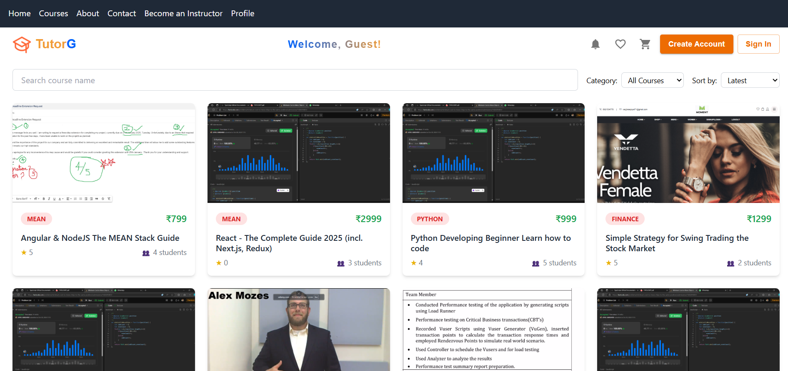
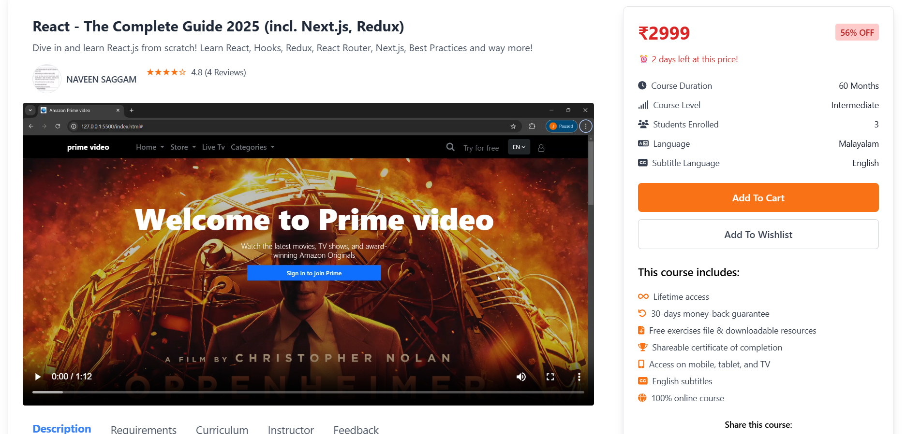

# 🎓 TutorG — Full-Stack E-Learning Platform
TutorG is a production-ready, full-stack E-Learning Platform designed for **Admins**, **Instructors**, and **Students**, built using **React + TypeScript** and **Node.js + Express (TypeScript)**.

It demonstrates real-world system design, clean architecture, and scalable backend practices commonly used in modern SaaS products.

---

## 🌟 Why TutorG?

TutorG goes beyond a simple CRUD application and showcases an end-to-end learning ecosystem:

- 🏗 **Enterprise-style Layered Architecture**: Controller → Service → Repository → Model
- 🧩 **Repository Pattern**: Clean data access and separation of concerns
- ⚡ **Service-Oriented Frontend**: Decoupled business logic into reusable service layers
- 🔐 **Advanced Security**: Zod validation, Rate limiting, and RBAC
- 📈 **Scalable System Design**: Decoupled Feedback system to handle millions of reviews
- 🛡 **Production Reliability**: Centralized Winston logging and strict Environment validation
- 🐳 **Dockerized**: One-command deployment for both local and production environments

---

## 🌟 Screenshots

Here are some real glimpses of the working platform:

<div align="center">
  
  <br><br>
  <em>Modern student Home Page with course recommendations & Tutors</em>
</div>

<br>
<div align="center">
  
  <br><br>
  <em>Modern Course Listing Page with course Listings </em>
</div>

<br>
<div align="center">
  
  <br><br>
  <em>Modern Course Detailed Page with course notes, reviews </em>
</div>

<br>
---

## 🚀 Live Demo & Source Code

🌐 **Live Application:**  
https://tutorg.vercel.app/

💻 **GitHub Repository:**  
https://github.com/JoyelV/tutorG

---

## 🧠 Product Overview

### 🎯 Purpose

TutorG provides a multi-role learning platform where:

- Admins manage the ecosystem
- Instructors create and manage courses
- Students browse, purchase, and consume learning content

### 👥 Supported Roles

- Admin
- Instructor
- Student

Each role operates with secure, isolated permissions and workflows.

---

## 🏗 Architecture & System Design

### 🔹 High-Level Architecture

- **Frontend:** React Single Page Application (SPA)
- **Backend:** RESTful API using Express
- **Database:** MongoDB (NoSQL)
- **Deployment:** Vercel (Frontend) — Backend deployable on Render, Railway, AWS, etc.

### 🔹 Backend Architecture (Key Highlight)

TutorG follows a **Clean Layered Architecture** with **Repository Pattern**:  
`Controller → Service → Repository → Model`

#### Advanced Engineering Practices Implemented:
1. **Frontend Service Layer**: Abstracted all API calls into services, making components lean and UI-focused.
2. **Input Validation (Zod)**: Robust, schema-based validation for all API endpoints.
3. **Rate Limiting**: Protection against brute-force and DoS attacks (100 req/15min).
4. **Scalable MongoDB Design**: Decoupled student feedback from the Course document to prevent unbounded growth.
5. **Observability (Winston)**: Centralized logging with persistent error files.
6. **Strict Config Management**: Type-safe environment variable validation at startup.
---

## 📂 Project Structure

```text
tutorG/
├── client/                        # 🎨 React + TypeScript Frontend
│   ├── public/
│   └── src/
│       ├── components/            # Reusable components
│       ├── pages/                 # Page components / routes
│       ├── hooks/
│       ├── contexts/
│       ├── types/
│       └── assets/
│
├── server/                        # ⚙️ Node.js + Express + TypeScript Backend
│   ├── src/
│   │   ├── controllers/           # Request handlers
│   │   ├── services/              # Business logic
│   │   ├── repositories/          # Data access layer
│   │   ├── models/                # Mongoose schemas
│   │   ├── routes/                # API routes
│   │   ├── middlewares/           # Auth, validation, errors
│   │   ├── config/                # Env, DB, Cloudinary...
│   │   ├── utils/                 # JWT, mailer, helpers...
│   │   └── server.ts              # Entry point
│   └── ...
│
├── screenshots/                   # 📸 Images for README
├── .env.example
└── README.md
---

## 🔐 Authentication & Security

- JWT-based authentication
- Secure password hashing
- Role-Based Access Control (RBAC)
- Protected routes using middleware
- Environment-based secret management
- Secure CORS configuration

---

## 🎓 Core Features

### 👩‍🏫 Instructor Features
- Create and manage courses
- Upload lessons and learning media
- Manage course content

### 👨‍🎓 Student Features
- Browse and enroll in courses
- Add courses to cart
- Place orders
- View lessons and quizzes
- Submit reviews

### 🛠 Admin Features
- Manage users and roles
- Oversee platform activity
- Control platform data

---

## 📦 Media & File Management

- Multer for file handling
- Cloudinary for secure cloud-based storage
- Optimized handling of image and video assets

---

## 🎨 Frontend Highlights

- Built using React + TypeScript
- Styled with Tailwind CSS
- Responsive & mobile-first UI
- Reusable, modular component design
- Clean API integration layer
- Accessible and user-friendly layouts

---

## ⚙️ Tech Stack

**Frontend**  
React · TypeScript · Tailwind CSS · Axios (Service Layer)

**Backend**  
Node.js · Express · TypeScript · MongoDB · Mongoose · **Zod** · **Winston**

**Infrastructure**  
**Docker** · **Docker Compose** · JWT · Cloudinary · Multer · Stripe

---

## 🚀 Deployment

- Frontend: Deployed on Vercel
- Backend: Production-ready Express server
- **Docker**: Both services are containerized for easy deployment on AWS, DigitalOcean, or any VPS.

### 🐳 Run with Docker
```bash
docker-compose up --build
```
This starts the Frontend (3000), Backend (5000), and MongoDB (27017).

---

## 🧪 Code Quality & Engineering Practices

- Type-safe codebase (TypeScript everywhere)
- Clean Architecture principles
- SOLID design approach
- Reusable services & repositories
- Scalable and maintainable structure

---

## 🎯 Ideal For Demonstrating

- MERN / Full-Stack Development
- Clean Architecture & Repository Pattern
- Role-based systems
- Production-ready API design
- Real-world SaaS product thinking

---

## 🤝 Contributing

Contributions are welcome!

1. Fork the repository
2. Create a feature branch
3. Commit clean, scoped changes
4. Open a pull request with a clear description

---

## 👨‍💻 Author

**Joyel Varghese**  
Full-Stack Developer  
(MERN | TypeScript | React | Node.js)

---